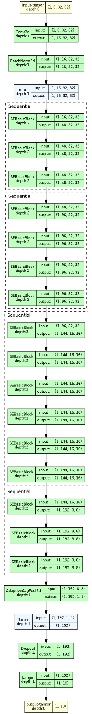
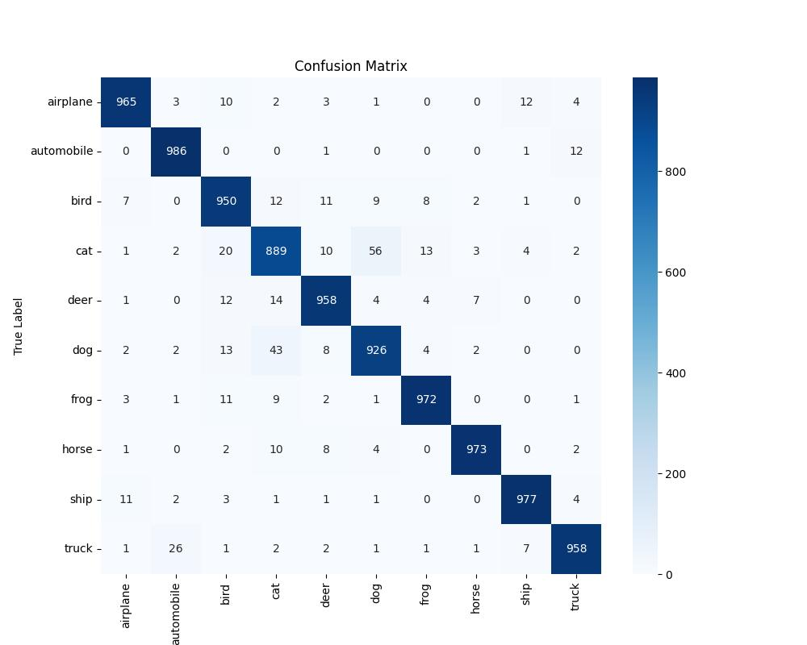
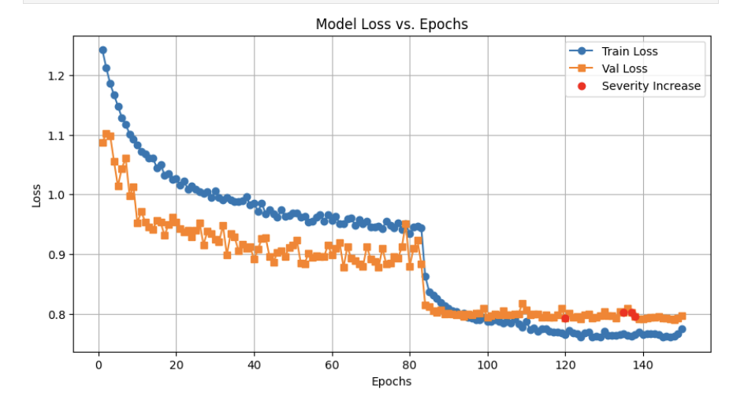

# CIFAAR-10-Resnet

This repository contains the code and report for **Assignment 1** of the Deep Learning course at NYU (Spring 2025). The goal of this project was to develop a modified ResNet architecture with under 5 million parameters to achieve high test accuracy on a held-out portion of the CIFAR-10 dataset, as part of a Kaggle competition. Our best model, incorporating Squeeze-and-Excitation (SE) blocks, curriculum-driven augmentations, and adversarial training, achieved a test accuracy of **84.582%**.

### Team Members
- Rishabh Budhouliya
- Samprith Kalakata (srk9068)
- Akshat Singh (as20255)

### Project Overview
We experimented with various ResNet modifications, focusing on architectural enhancements (e.g., SE blocks), data augmentation strategies (e.g., harsh augmentations, Mixup), and training techniques (e.g., FGSM adversarial training). Our final model (Experiment 4) balanced complexity and efficiency with 4,912,677 parameters. The report details our methodology, experiments, and results.

### Key Visualizations

#### Model Architecture
The following diagram visualizes our best model (ResNet with SE blocks, [3, 4, 6, 3] blocks, channels [48, 96, 144, 192]):

#### Confusion Matrix (Validation Data)
This confusion matrix shows the performance of our best model on the validation set, highlighting classification performance across CIFAR-10 classes:

#### Loss Curves
The plot below tracks training and validation loss over 150 epochs, with red dots indicating points where augmentation severity was increased:

For more details, refer to the project report.
